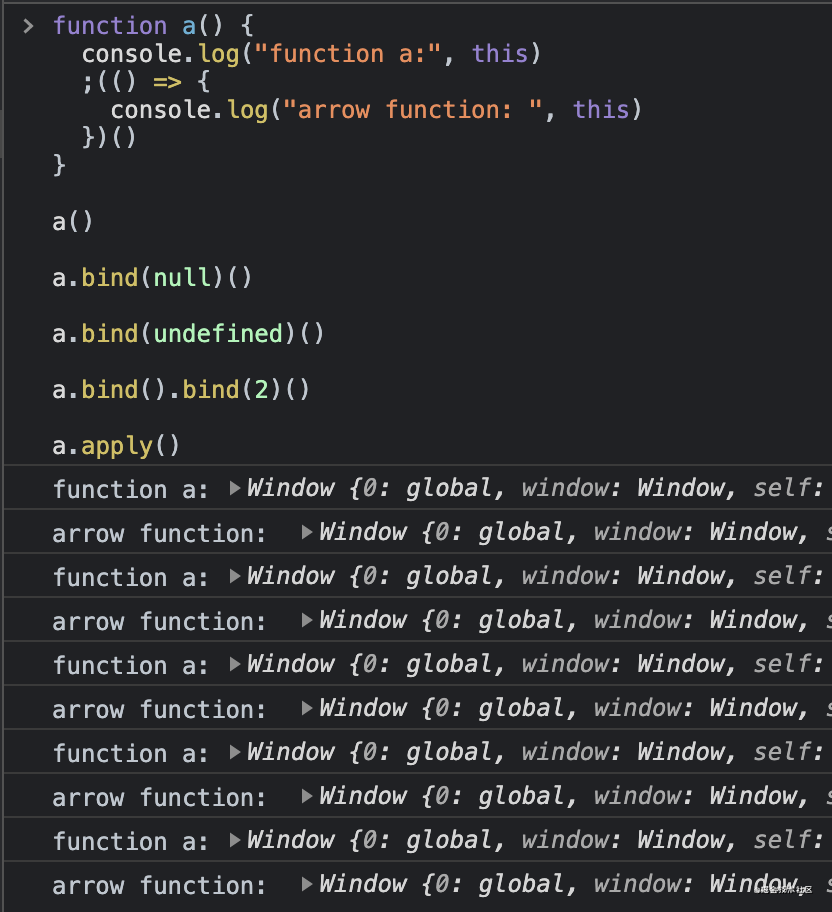

> 本文基本是复制该文章[ JS 中 this 指向问题](https://juejin.cn/post/6946021671656488991)
> 作者：MoonBall
> 链接：https://juejin.cn/post/6946021671656488991
> 来源：掘金


# JS 中 this 指向问题

相信我，只要记住本文的 7️⃣ 步口诀，就能彻底掌握 JS 中的 this 指向。

先念口诀：箭头函数、new、bind、apply 和 call、欧比届点（obj.）、直接调用、不在函数里。

按照口诀的顺序，只要满足前面某个场景，就可以确定 this 指向了。

接下来按照口诀顺序对它们进行详解，文中示例代码都运行在 Chrome 的 Console 控制台中。

文末有精心准备的练习题，用于检验学习成果，别忘了试试~


## 1. 箭头函数

箭头函数排在第一个是因为它的 this 不会被改变，所以只要当前函数是箭头函数，那么就不用再看其他规则了。

箭头函数的 this 是在创建它时外层 this 的指向。这里的重点有两个：

1. **创建箭头函数时**，就已经确定了它的 this 指向。
2. 箭头函数内的 this 指向**外层的 this**。

所以要知道箭头函数的 this 就得先知道外层 this 的指向，需要继续在外层应用七步口诀。


## 2. new

**当使用 new 关键字调用函数时，函数中的 this 一定是 JS 创建的新对象。**

读者可能会有疑问，“如果使用 new 关键调用箭头函数，是不是箭头函数的 this 就会被修改呢？”。

我们在控制台试一下。

```js
func = () => {}
new func() // throw error
```

从控制台中可以看出，箭头函数不能当做构造函数，所以不能与 new 一起执行。


## 3. bind

bind 是指 [Function.prototype.bind()](https://link.juejin.cn?target=https%3A%2F%2Fdeveloper.mozilla.org%2Fzh-CN%2Fdocs%2FWeb%2FJavaScript%2FReference%2FGlobal_Objects%2FFunction%2Fbind)。

### 多次 bind 时只认第一次 bind 的值

**易错点**

```js
function func() {
  console.log(this)
}

func.bind(1).bind(2)() // 1
```

### 箭头函数中 this 不会被修改

```js
func = () => {
  // 这里 this 指向取决于外层 this，参考口诀 7 「不在函数里」
  console.log(this)
}

func.bind(1)() // Window，口诀 1 优先
```

### bind 与 new

**易错点**

```js
function func() {
  console.log(this, this.__proto__ === func.prototype)
}

boundFunc = func.bind(1)
new boundFunc() // Object true，口诀 2 优先
```


## 4. apply 和 call

`apply()` 和 `call()` 的第一个参数都是 this，区别在于通过 apply 调用时实参是放到数组中的，而通过 call 调用时实参是逗号分隔的。

### 箭头函数中 this 不会被修改

**易错点**

```js
func = () => {
  // 这里 this 指向取决于外层 this，参考口诀 7 「不在函数里」
  console.log(this)
}

func.apply(1) // Window，口诀 1 优先
```

### bind 函数中 this 不会被修改

**易错点**

```js
function func() {
  console.log(this)
}

boundFunc = func.bind(1)
boundFunc.apply(2) // 1，口诀 3 优先
```


## 5. 欧比届点（obj.）

```js
function func() {
  console.log(this.x)
}

obj = { x: 1 }
obj.func = func
obj.func() // 1
复制代码
```

这里就不用代码例证箭头函数和 bind 函数的优先级更高了，有兴趣可自行尝试吧。


## 6. 直接调用

在函数不满足前面的场景，被直接调用时，this 将指向全局对象。在浏览器环境中全局对象是 Window，在 Node.js 环境中是 Global。

先来个简单的例子。

```js
function func() {
  console.log(this)
}

func() // Window
```

来一个复杂的例子，外层的 outerFunc 就起个迷惑目的。

```js
function outerFunc() {
  console.log(this) // { x: 1 }

  function func() {
    console.log(this) // Window
  }

  func()
}

outerFunc.bind({ x: 1 })()
```


## 7. 不在函数里

不在函数中的场景，可分为浏览器的 `<script />` 标签里，或 Node.js 的模块文件里。

1. 在 `<script />` 标签里，this 指向 Window。
2. 在 Node.js 的模块文件里，this 指向 Module 的默认导出对象，也就是 module.exports。


## 非严格模式

严格模式是在 ES5 提出的。在 ES5 规范之前，也就是非严格模式下，this 不能是 undefined 或 null。所以**在非严格模式下，通过上面七步口诀，如果得出 this 指向是 undefined 或 null，那么 this 会指向全局对象。**在浏览器环境中全局对象是 Window，在 Node.js 环境中是 Global。

例如下面的代码，在非严格模式下，this 都指向全局对象。

```js
function a() {
  console.log("function a:", this)
  ;(() => {
    console.log("arrow function: ", this)
  })()
}

a()

a.bind(null)()

a.bind(undefined)()

a.bind().bind(2)()

a.apply()
```

非严格模式下执行结果为： 

在严格模式下，执行同样的代码进行对比。记住要一次性将所有代码复制粘贴到控制台中，才能运行在严格模式下（因为第一行 "use strict" 才会对后面的代码生效）。

```js
"use strict"

function a() {
  console.log("function a:", this)
  ;(() => {
    console.log("arrow function: ", this)
  })()
}

a()

a.bind(null)()

a.bind(undefined)()

a.bind().bind(2)()

a.apply()
```

严格模式下执行结果为： 

七步口诀在严格模式下和非严格模式下都是完备的，只是在非严格模式下 null 或 undefined 会被转换为全局对象。所以我没有将这点列入口诀中。


## 做题复习

先背诵口诀再做题，“箭头函数、new、bind、apply 和 call、欧比届点（obj.）、直接调用、不在函数里”。

### 1. 下面代码执行后，func.count 值为多少？

```js
function func(num) {
  this.count++
}

func.count = 0
func(1)
```

#### 答案

func.count 值为 0。

按照口诀，`func()` 调用时属于第 6 类「直接调用」。在非严格模式下，`this` 指向全局对象。`this` 跟 func 一点关系都没有，所以 `func.count` 保持不变。so easy。

### 2. 以下箭头函数中 this 指向谁呢？

```js
obj = {
  func() {
    const arrowFunc = () => {
      console.log(this._name)
    }

    return arrowFunc
  },

  _name: "obj",
}

obj.func()()

func = obj.func
func()()

obj.func.bind({ _name: "newObj" })()()

obj.func.bind()()()

obj.func.bind({ _name: "bindObj" }).apply({ _name: "applyObj" })()
```

#### 答案

```js
// obj
// undefined
// newObj
// undefined
// bindObj
```

是不是很简单，你学废了吗？
