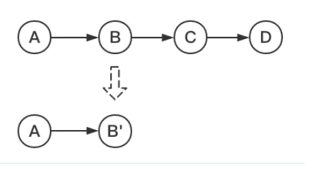
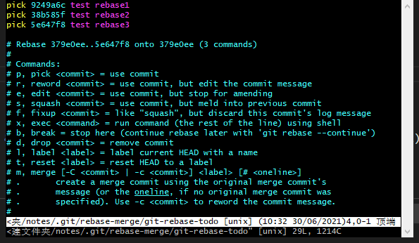
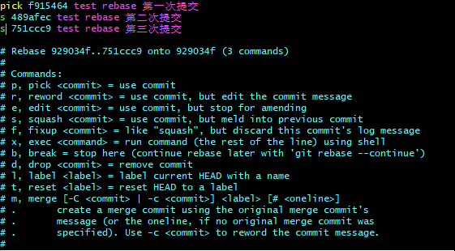
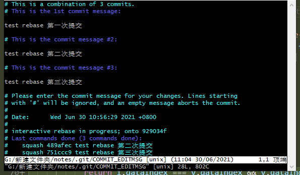
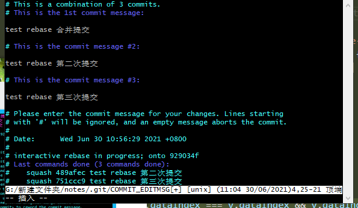
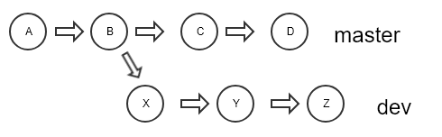
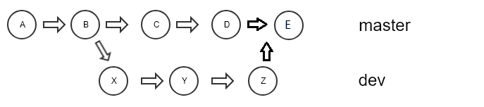
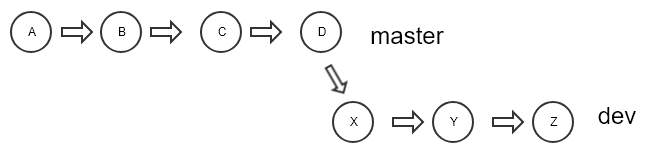

## 前言


我们不说那些 `git push， git merge， git reset` 等等，这些基操，这里主要讲一下 `git rebase， git cherry-pick， git reflog` 三个可能会用到的操作。


## git rebase


### 两个作用


#### 作用一：合并多次提交记录


一个小功能更改，提交 几十次 ，项目充满了无用的 `commit` 纪录。


##### 简介


简要概括为：可以对某一段线性提交历史进行编辑、删除、复制、粘贴；因此，合理使用`rebase`命令可以使我们的提交历史干净、简洁！


##### 使用方法


这里介绍合并提交：





1. 命令

   ```shell
   git rebase -i  [startpoint]  [endpoint]
   ```

   - `-i`的意思是`--interactive`，即弹出交互式的界面让用户编辑完成合并操作。
   - `[startpoint] [endpoint]`则指定了一个编辑区间。（一个前开后闭的区间）

   或者

   ```shell
   git rebase -i HEAD~3 
   ```

   - 最新的三个`commit`

     

2. 然后进入`vi` 编辑模式

   

   

   上面的是本次`rebase`操作包含的所有提交，下面注释的是git命令说明。

   > pick：保留该commit（缩写:p）
   >
   > reword：保留该commit，但我需要修改该commit的注释（缩写:r）
   >
   > edit：保留该commit, 但我要停下来修改该提交(不仅仅修改注释)（缩写:e）
   >
   > squash：将该commit和前一个commit合并（缩写:s）
   >
   > fixup：将该commit和前一个commit合并，但我不要保留该提交的注释信息（缩写:f）
   >
   > exec：执行shell命令（缩写:x）
   >
   > drop：我要丢弃该commit（缩写:d）

3. 修改2、3的第一个单词为s，输入：`wq` or `x` 保存退出。

   

4. 有冲突解决冲突。没有则会出现一个 `commit message` 编辑页面。

   

   修改 `commit message` ，然后 输入：`wq` or `x` 保存退出。

   

5. 查看结果

   ```shell
   git log
   ```

6. 异常退出vi窗口，想回去：

   ```shell
   git rebase --edit-todo
   ```

7. 放弃此次压缩：

   ```shell
   git rebase --abort
   ```


当然，你可以使用其他命令比如：d（删除），修改这几次的提交。


#### 作用二：分支合并（变基） 


从 `master` 分支切出一个 `dev` 分支，进行开发，你的同事在`master`上完成一次提交，这时两个分支情况：





我们想要同步 `master` 分支的改动，首先想到了 `merge`，还有一个命令就是`rebase`，那这两个的区别是什么呢？


##### merge 和 rebase 的区别


两张图就可以看出：

merge：

​	


1. 新增一个新的 **`merge commit`**，然后将两个分支的历史联系在一起。
2. 使用 `merge` 是很好的方式，因为它是一种**非破坏性的**操作，对现有分支不会以任何方式被更改。


rebase：





1. `rebase` 会将整个 `dev` 分支移动到 `master` 分支的**顶端**，从而有效地整合了所有 `master` 分支上的提交。

2. `rebase` 通过为原始分支中的每个提交创建全新的 `commits` 来重写项目历史记录,特点是仍然会在`dev`分支上形成线性提交。


> **`Git rebase`并不会删除老的提交**，也就是说你在对某个分支执行了`rebase`操作之后，老的提交仍然会存放在.git文件夹的objects目录下。


##### git rebase 做了什么


1. `git` 会把 `dev` 分支里面的每个 `commit` 取消掉；

2. 把上面的操作临时保存成 `patch` 文件，存在 `.git/rebase` 目录下；
3. 把 `dev` 分支更新到最新的 `master` 分支；
4. 把上面保存的 `patch` 文件应用到 `dev` 分支上。


##### 使用方法


1. 命令：

   ```shell
   git rebase master  #将master最新的commit作为基
   ```


2. 解决冲突：

   `rebase` 和 `merge`的另一个区别是`rebase` 的冲突是一个一个解决，如果有十个冲突，先解决第一个，然后用命令：

   ```shell
   # 解决冲突
   git add xxx
   git rebase --continue
   ```

   继续后才会出现第二个冲突。

3. 在任何时候，我们都可以用 `--abort` 参数来终止 `rebase` 的行动，并且分支会回到 `rebase` 开始前的状态。

   ```shell
   git rebase —abort
   ```


##### 总结

1. 融合代码到公共分支的时使用`git merge`,而不用`git rebase`

2. 融合代码到个人分支的时候使用`git rebase`，可以不污染分支的提交记录，形成简洁的线性提交历史记录。


#### 作用三：将某一段commit粘贴到另一个分支上


这个建议使用`git cherry-pick`，我也没实践过。


## git cherry-pick

### 使用场景

### 使用方法

## git reflog

### 使用场景

 


