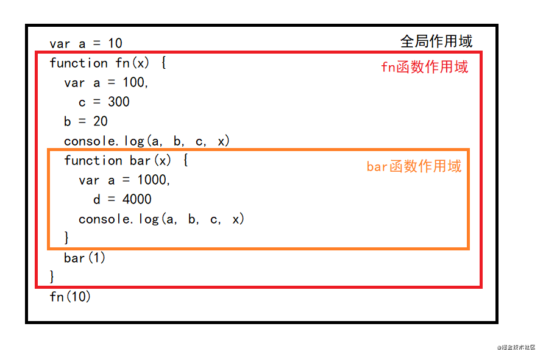
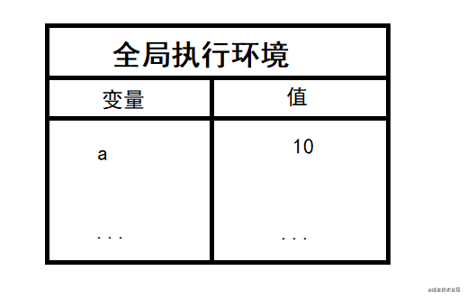
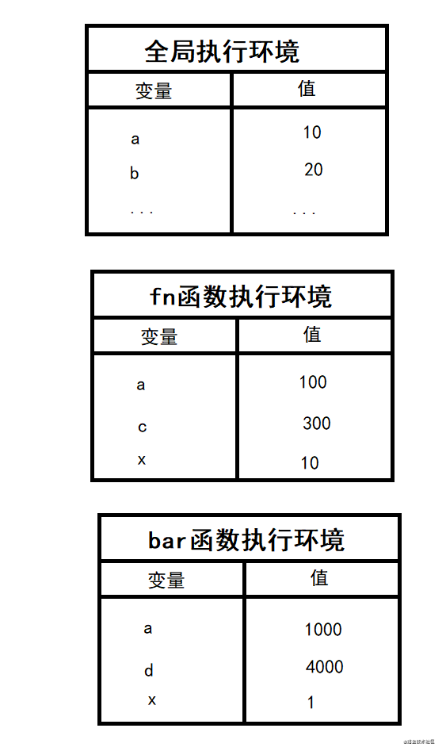
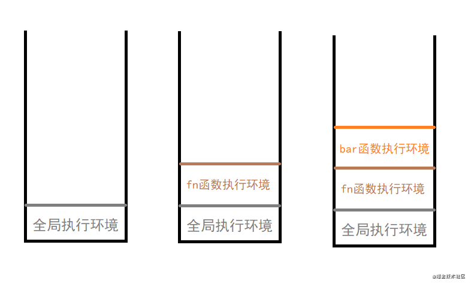

> 本文基本是复制该文章[作用域的延伸](https://juejin.cn/post/6970247869722787871)
> 作者：ClyingDeng
> 链接：https://juejin.cn/post/6970247869722787871
> 来源：掘金


# 作用域的延伸

从变量、函数的声明提升开始，到作用域、作用域链的重新理解。带你重新回顾作用域引发的一系列问题探讨，再一次巩固js作用域基础。


# 声明提升

## 变量声明提升

使用var关键字声明的变量会在代码执行之前被声明(但不会赋值--undefined)

```js
console.log(a);  //undefined
var a = 'xxx'
```

## 函数声明提升

使用函数声明式创建的函数在代码执行之前就被创建，可在函数声明前调用，但是使用函数表达式创建的函数，不会被声明提前(not defined)

```js
fun1()   // 111
function fun1() {
  console.log(111)
}
fun2()   // fun2 is not a function
var fun2 = function () {
  console.log(222)
}
```


# 作用域

作用域：一个变量作用的范围区域。
作用域分为全局作用域、函数作用域。
作用：隔离变量，在不同的作用与中定义相同的变量而不相互影响。

## 全局作用域

全局作用域在页面打开时创建，关闭时销毁。

全局作用域中有一个全局对象window(代表一个浏览器窗口，由浏览器创建)可直接使用。

创建的变量会作为全局的属性保存(任意部分都可以访问)，创建函数的时候会作为全局的方法保存。

## 函数作用域

**函数在定义时确定函数的作用域**，由函数声明的位置决定，执行完成之后函数作用域销毁。每调用一个函数都会创建一个函数作用域，之间相互独立。

函数作用域中可以访问全局作用域变量，但是全局变量无法访问函数作用域内的变量。在函数作用域中，操作一个变量，如果该变量在当前作用域不存在，就会往上级找，直到全局作用域。

```js
var e = 0
    fun1()   // 0
function fun1() {
  var a = 1
  console.log(e)
}
console.log(a)  // ReferenceError: a is not defined
```

在函数作用域中，不使用var声明变量都会变成全局变量

```js
var e = 0
function fun1() {
  console.log(e)
  e = 1
}
fun1()  // 0
console.log(e) // 1
```

函数中的形参就相当于在函数中定义了变量

```js
var e = 0
fun1()  // undefined
function fun1(e) {
  console.log(e)
}
```

## 作用域其他分类

作用域还可以分为：静态作用域、动态作用域。

静态作用域：又称词法作用域，采用词法作用域的变量叫词法变量。词法变量在**词法作用域内可见，在词法作用域外不可见**。静态作用域由函数定义位置决定，js中的作用域就是静态作用域（词法作用域）。

```js
  function bar() {
    var a = 1000
  }
```

动态作用域：采用动态作用域的变量叫动态变量。在动态作用域执行时间内，该变量一直存在；代码段执行结束，该变量消失。由函数运行被**调用时**的位置决定。

```js
function fn() {
  console.log(x)
}
function show() {
  var x = 20
  fn()
}
```

调用show()时，它会调用fn()。在执行期间，fn()被show()调用代表了一种动态关系。


# 作用域链

定义：存在作用域嵌套，嵌套的作用域是由内向外的一个结构。
 作用：查找变量。

当代码**在一个环境中执行时**，会创建变量对象的一个作用域链。通过作用域链保证有权访问的所有变量和函数，进行有序访问。
 作用域链在函数定义时已经确定，作用域链是和函数定义时的位置相关的。

例1：

```js
var x = 10
function fn() {
  console.log(x)
}
function show() {
  var x = 20
  fn()
}
show()  // 10
```

例2：

```js
var x = 10
function show1() {
  var x = 20
  function fn() {
    console.log(x)
  }
  fn()
}
show1()  // 20
```

理解： 函数作用域在定义时就已经确定，所以在例1中，函数fn的父级作用域是window。当fn内不存在x时，会向其父级找寻x，父级存在x变量。所以输出10。
 例2中，fn的父级环境是show1函数，所以到show1中找x，输出20。


# 执行环境与执行环境栈

**作用域是静态的**，只要**函数定义**好就会一直存在且不变化；**执行环境是动态的**，**调用函数时**创建，函数调用结束自动销毁。

执行上下文分为：全局执行上下文、函数执行上下文。这里执行上下文又称为执行环境。在代码运行时会创建相应的执行环境。

## 全局执行环境

在执行全局代码之前，将window确定为全局执行环境。 然后对全局数据进行预处理：全局变量添加为window属性、function声明全局函数添加为window方法，this指向window。

## 函数执行环境

在**函数运行时**，创建对应的函数执行环境对象。对局部数据进行预处理。

## 执行环境栈

在全局代码执行之前，js引擎就会创建一个栈来存储管理所有执行环境的对象。

在全局执行环境确定后，会将全局执行环境添加到栈中。

在函数执行环境创建后，将函数执行环境添加入栈。

函数执行完成后，将函数执行环境从栈中移除。

所有代码执行完成后，栈中会只剩下window全局执行环境。


# 函数的运行流程

```js
var a = 10
function fn(x) {
  var a = 100,
    c = 300
  b = 20
  console.log(a, b, c, x)
  function bar(x) {
    var a = 1000,
      d = 4000
    console.log(a, b, c, x)
  }
  bar(1)
}
fn(10)  
// 100  20  300  10
// 1000  20  300  1
```

首先，确定全局作用域和函数作用域。  其次，依次确定相应的执行环境，要时刻谨记执行环境是动态的。

fn函数代码执行之前创建全局执行环境，记录全局变量。 

执行函数fn时，创建fn函数执行环境。在fn函数内部存在b未定义变量，b会变成全局变量。执行bar函数时，创建bar函数执行环境。此时的各执行环境如下图：



运行fn函数，输出a、b、c、x。当前**作用域对应的执行环境**中，创建变量对象的相应作用域链。a存在输出100，c存在输出300，x存在输出10。b不存在于当前执法环境中，通过作用域链向其上一级作用域寻找，即全局作用域。在全局作用域对应的全局执行环境中，存在b变量输出20（此过程称为“变量解析”）。

**注意：** 此时输出语句在b定义之后，当执行完b = 20时，b变量已经存在于全局执行环境中，所以输出时b存在且值为20。如果b = 20与输出语句互换，则输出语句中b未定义（全局执行环境中无b）。

在bar函数中，输出a、b、c、x。当前作用域对应的执行环境中，a存在输出1000，x存在输出1。b不存在，向其父级fn作用域寻找，fn执行环境中无b。再向上一级作用域中寻找，即全局作用域。在全局执行环境中，存在b变量，且值为20，所以输出的b为20。c不存在当前作用域，所以向其父级fn函数作用域中寻找c，存在且值为300，所以c输出300。

## 执行环境栈的流程

代码执行时，会先创建一个执行环境栈。当执行流进入一个函数时，函数的执行环境就会被压入执行栈中，函数执行完成之后，会将其环境弹出。

1、 在上例中，先进入全局执行环境，将全局执行环境压入执行栈中。
 2、 执行fn，将fn执行环境压入栈中。
 3、 fn中执行bar，将bar压入执行环境栈中。



4、 当执行完bar后，bar函数执行环境从栈中移除。
 5、 执行完fn后，fn的执行环境从栈中移除。
 6、 执行完成后，只剩全局执行环境存在于栈中。
 7、 当页面关闭，全局执行环境移除，执行环境栈销毁。