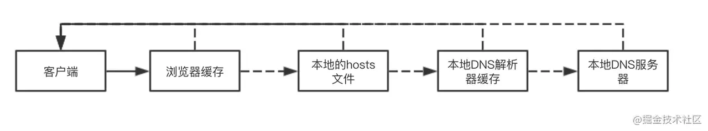
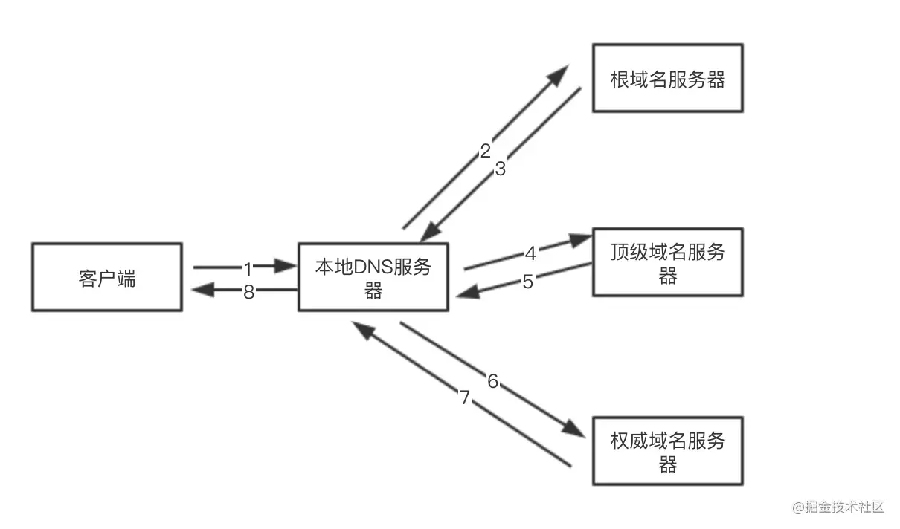
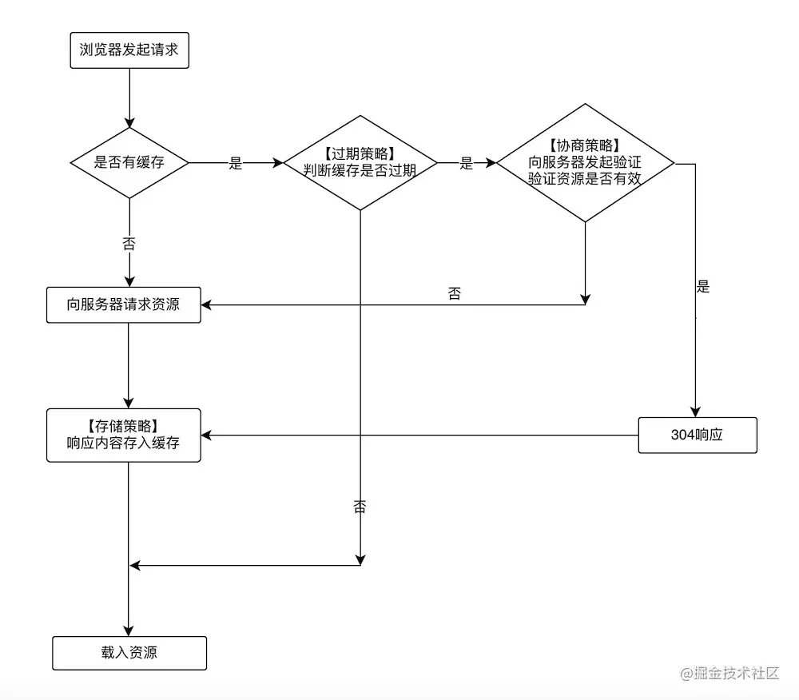
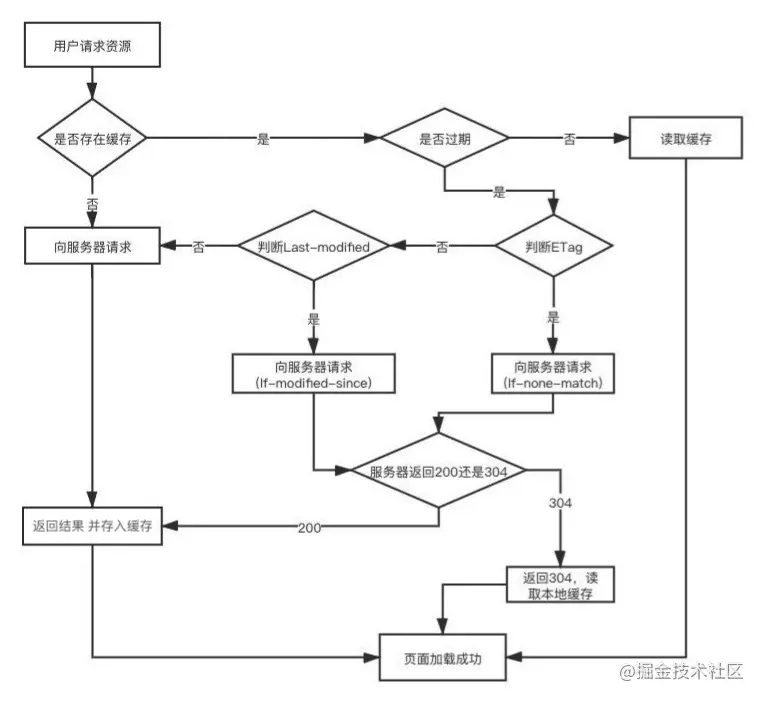

> 本文基本是复制该文章[(建议收藏)为什么第二次打开页面快？五步吃透前端缓存，让页面飞起](https://juejin.cn/post/6993358764481085453)
> 作者：沐华
> 链接：https://juejin.cn/post/6993358764481085453
> 来源：掘金

# 为什么第二次打开页面快？五步吃透前端缓存，让页面飞起

如何使首屏加载更快？

为什么第二次打开页面会快很多？

怎么让刷新或关闭浏览器之后数据依然不被清空？

主要是因为第一次加载页面过程中，缓存了一些数据，之后再加载就直接从缓存中获取而不用请求服务器，所以速度更快，也减轻了服务器的压力

无论是面试还是性能优化，缓存对于前端来说都是非常重要的且必不可少的内容。本文主要内容就是针对这这一块进行详细梳理总结，如果对你有帮助，就点赞支持一波吧

这个过程主要有两方面

网络方面的缓存分为三块：`DNS缓存`、`HTTP缓存`、`CDN缓存`，也有人把这里的 **HTTP 缓存**称为**浏览器缓存**，反正懂意思就行

还有本地的就是：浏览器的`本地存储`和`离线存储`，更快**提高首屏加载速度**，让页面飞起。

## DNS缓存

进入页面的时候会进行DNS查询，找到域名对应的服务器的IP地址，再发送请求

网上流程图很多，我从中借鉴了两张

DNS域名查找先在客户端进行`递归查询`，如图

 在任何一步找到就会结束查找流程，而整个过程客户端只发出一次查询请求

如果都没有找到，就会走DNS服务器设置的转发器，如果没设置转发模式，则向`13根`发起解析请求，这里就是`迭代查询`，如图

```
13根：
全球共有13个根域服务器IP地址，不是13台服务器！
因为借助任播技术，可以在全球设立这些IP的镜像站点，所以访问的不是唯一的那台主机
```



很明显，整个过程会发出多次查询请求

在第一次进入页面后就会把DNS解析的地址记录缓存在客户端，之后再进的话至少不需要发起后面的迭代查询了，从而速度更快。


## HTTP缓存

就是将http请求获取的页面资源存储在本地，之后再加载直接从缓存中获取而不用请求服务器，从而响应更快。先看图：



### 强缓存

第一次请求时，服务器把资源的过期时间通过响应头中的`Expires`和`Cache-Control`两个字段告诉浏览器，之后再请求这个资源的话，会判断有没有过期，没有过期就直接拿来用，不向服务器发起请求，这就是强缓存

**`Expires`**

用来指定资源到期绝对时间，服务器响应时，添加在响应头中。

```js
expires: Wed, 22 Nov 2021 08:41:00 GMT
```

注意：如果服务器和浏览器端时间不一致的话可能导致失败。比如现在时间是8月1，expires过期时间是8月2，客户端把电脑时间改成了8月3，那就用不了这个缓存

**`Cache-Control`**

指定资源过期时间秒，如下，表示在这个请求正确返回后的300秒内，资源可以使用，否则过期

```js
cache-control:max-age=300
```

**为什么指定缓存过期时间需要两个字段呢？**

- 因为有的浏览器只认识 Cache-Control，有的浏览器不认识，不认识的情况下再找 Expires。
- Expires的**服务器的时间和浏览器的时间可能并不一致**，那服务器返回的这个过期时间可能就是不准确的。

**Expires 和 Cache-Control 的区别**

- Expires 是`HTTP/1.0`中的，Cache-Control 是`HTTP/1.1`中的;
- Expires 是为了兼容，在不支持 `HTTP/1.1` 的情况下才会发生作用
- 两者同时存在的话 Cache-Control 优先级高于 Expires;

**Cache-Control`请求头`常见属性**

| 字段(单位秒)    | 说明                                                         |
| --------------- | ------------------------------------------------------------ |
| max-age=300     | 拒绝接受长于300秒的资源，为0时表示获取最新资源               |
| max-stale=100   | 缓存过期之后的100秒内，依然拿来用                            |
| min-fresh=50    | 缓存到期时间还剩余50秒开始，就不给拿了，不新鲜了             |
| no-cache        | 协商缓存验证                                                 |
| no-store        | 不使用缓存                                                   |
| only-if-chached | 只使用缓存，没有就报504错误                                  |
| no-transform    | 不得对资源进行转换或转变。Content-Encoding, Content-Range,  Content-Type等HTTP头不能由代理修改。然并卵 |

**多少秒是自定义的，我这里写死是方便理解**

**Cache-Control`响应头`常见属性**

| 字段(单位秒)     | 说明                                                  |
| ---------------- | ----------------------------------------------------- |
| max-age=300      | 缓存有效期300秒                                       |
| s-maxage=500     | 有效期500秒，优先级高于max-age，适用于共享缓存(如CDN) |
| public           | 可以被任何终端缓存，包括代理服务器、CDN等             |
| private          | 只能被用户的浏览器终端缓存(私有缓存)                  |
| no-cache         | 先和服务端确认资源是否发生变化，没有就使用            |
| no-store         | 不缓存                                                |
| no-transform     | 与上面请求指令中的一样                                |
| must-revalidate  | 客户端缓存过期了就向源服务器验证                      |
| proxy-revalidate | 代理缓存过期了就去源服务器重新获取                    |

#### 强缓存的缺点

**就是缓存过期之后，不管资源有没有变化，都会重新发起请求，重新获取资源**

而我们希望的是在资源文件没有更新的情况下，即使过期了也不重新获取资源，继续使用旧资源

所以协商缓存它来了，在强缓存过期的情况下，再走协商缓存的流程，判断文件有没有更新

### 协商缓存

第一次请求资源时，服务器除了会返回给浏览器上面说的过期时间，还会在响应头添加 `Last-Modified` 字段，告诉浏览器该资源的最后修改时间

```js
last-modified: Fri, 27 Oct 2021 08:35:57 GMT
```

然后浏览器再次请求的时候就把这个时间再通过另一个字段`If-Modified-Since`，发送给服务器

```js
if-modified-since: Fri, 27 Oct 2021 08:35:57 GMT
```

服务器再把这两个字段的时间对比，如果是一样的，就说明文件没有被更新过，就返回状态码304和空响应体给浏览器，浏览器直接拿过期了的资源继续使用即可；如果对比不一样说明资源有更新，就返回状态码200和新的资源，如图



所以说`Last-Modified`/`If-Modified-Since`它俩是成对的，是为了对比文件修改时间

**缺点**

- 如果本地打开了缓存文件，即使没有对文件进行修改，但还是会造成`Last-Modified`被修改，服务器端不能命中缓存导致发送相同资源
- 因为`Last-Modified`只能以秒计时，如果在不可感知的时间内修改了文件，服务器端会认为还是命中了，无法返回正确的资源
- 如果资源有周期性变化，如资源修改后，在一个周期内又改回了原来的样子，我们认为这个周期前的缓存是可以使用的，但是`Last-Modified`不这样认为

因为这些缺点，所以便有了另外一对 `ETag`/`If-None-Match`，用来对比文件内容

**`ETag`/`If-None-Match`**

第一次请求资源时，服务器除了会在响应头上返回`Expires`、`Cache-Control`、`Last-Modified`，还在返回`Etag`字段，表示当前资源文件的一个唯一标识。这个标识符由服务器基于文件内容编码生成，能精准感知文件的变化，只要文件内容不同，`ETag`就会重新生成

```js
etag: W/"132489-1627839023000"
```

然后浏览器再次请求的时候就把这个文件标识 再通过另一个字段 `If-None-Match`，发送给服务器

```js
if-none-match: W/"132489-1627839023000"
```

服务器再把这两个字段的时间对比，如果发现是一样的，就说明文件没有被更新过，就返回状态码304和空响应体给浏览器，浏览器直接拿过期了的资源继续使用；如果对比不一样说明资源有更新，就返回状态码200和新的资源

**`Last-Modified 和 ETag 的区别`**

- `Etag` 感知文件精准度要高于 `Last-Modified`
- 同时使用时，服务器校验优先级 `Etag`/`If-None-Match`
- `Last-Modified` 性能上要优于 `Etag`，因为 `Etag` 生成过程中需要服务器付出额外开销，会影响服务器端的性能，所以它并不能完全替代 `Last-Modified`，只能作为补充和强化

### 强缓存与协商缓存的区别

- 优先查找强缓存，没有命中再查找协商缓存
- 强缓存不发请求到服务器，所以有时候资源更新了浏览器还不知道，但是协商缓存会发请求到服务器，资源是否有更新，服务器肯定知道
- 目前项目大多数使用缓存文案
  1. 协商缓存一般存储：`HTML`
  2. 强缓存一般存储：`css`, `image`, `js`，文件名带上 `hash`

### 启发式缓存

就是响应中没有`Expires`，`Cache-Control：max-age`或`Cache-Control:s-maxage`，并且响应中不包含其他有关缓存的限制，缓存可以使用启发式方法计算缓存有效期

通常会根据响应头中的`Date`字段(报文创建时间)减去`Last-Modified`值的10%作为缓存时间

```js
max(0,（Date - Last-Modified)) % 10
```

### 缓存实际使用策略

**对于频繁变动的资源**：

使用`Cache-Control：no-cache`，使浏览器每次都请求数据，然后配合`Etag`或`Last-Modified`来验证资源是否有效，这样虽然不能节省请求数量，但能显著减少响应数据大小

**对于不常变化的资源**：

可以给它们的`Cache-Control`配置一个很大的`max-age=31536000`(一年)，这样浏览器之后请求相同的URL会命中强缓存，而为了解决更新问题，就需要在文件名(或者路径)中添加`hash`，版本号等动态字符，之后更改动态字符，从而达到更改引用URL的目的，让之前的强缓存失效(其实并未立即失效，只是不再使用了而已)


## CDN缓存

当我们发送一个请求时，浏览器本地缓存失效的情况下，CDN会帮我们去计算哪得到这些内容的路径短而且快。

比如在广州请求广州的服务器就比请求新疆的服务器响应速度快得多，然后向最近的CDN节点请求数据

CDN会判断缓存数据是否过期，如果没有过期，则直接将缓存数据返回给客户端，从而加快了响应速度。如果CDN判断缓存过期，就会向服务器发出回源请求，从服务器拉取最新数据，更新本地缓存，并将最新数据返回给客户端。

CDN不仅解决了跨运营商和跨地域访问的问题，大大降低访问延时的同时，还起到了分流的作用，减轻了源服务器的负载

[进阶知识体系之你不能不知道的CDN](https://juejin.cn/post/6985816725098856479)


## 本地存储

### Cookie

最早被提出来的本地存储方式，在每一次 http 请求携带 Cookie，可以判断多个请求是不是同一个用户发起的，特点是：

- 有安全问题，如果被拦截，就可以获得 Session 所有信息，然后将 Cookie 转发就能达到目的。(关于攻击和防范本可以看另一篇文章 [吃透浏览器安全（同源限制/XSS/CSRF/中间人攻击）](https://juejin.cn/post/6991888178890145828))
- 每个域名下的Cookie不能超过20个，大小不能超过4kb
- Cookie在请求新页面的时候都会被发送过去
- Cookie创建成功名称就不能修改
- 跨域名不能共享Cookie

**如果要跨域名共享Cookie有两个方法**

- 用 Nginx 反向代理
- 在一个站点登录之后，往其他网站写 Cookie。服务端的 Session 存储到一个节点，Cookie 存储 SessionId

**Cookie的使用场景**

- 最常见的就是 Cookie 和 Session 结合使用，将 SessionId 存储到 Cookie 中，每次请求都会带上这个 SessionId 这样服务端就知道是谁发起的请求
- 可以用来统计页面的点击次数

**Cookie都有哪些字段**

- `Name`、`Size` 故名思意
- `Value`：保存用户登录状态，应该将该值加密，不能使用明文
- `Path`：可以访问此 Cookie 的路径。比如 juejin.cn/editor ，path是/editor，只有/editor这个路径下的才可以读取 Cookie
- `httpOnly`：表示禁止通过 JS 访问 Cookie，减少 XSS 攻击。
- `Secure`：只能在 https 请求中携带
- `SameSite`：规定浏览器不能在跨域请求中携带 Cookie 减少 CSRF 攻击，详细说明[看这里](https://juejin.cn/post/6991888178890145828)
- `Domain`：域名，跨域或者 Cookie 的白名单，允许一个子域获取或操作父域的 Cookie，实现单点登录的话会非常有用
- `Expires`/`Max-size`：指定时间或秒数的过期时间，没设置的话就和 Session 一样关闭浏览器就失效

### LocaStorage

是H5的新特性，是将信息存储到本地，它的存储大小比 Cookie 大得多，有5M，而且是永久存储，除非主动清理，不然会一直存在

受到同源策略限制，就是端口、协议、主机地址有任何一样不同都不能访问，还有在浏览器设为隐私模式下，也不能读取 LocalStorage

它的使用场景就很多了，比如存储网站主题、存储用户信息、等等，存数数据量多或者不怎么改变的数据都可以用它

### SessionStorage

SessionStorage 也是H5新特性，主要用于临时保存同一窗口或标签页的数据，刷新页面时不会删除，但是关闭窗口或标签页之后就会删除这些数据

SessionStorage 和 LocalStorage 一样是在本地存储，而且都不能被爬虫爬取，并且都有同源策略的限制，只不过 SessionStorage 更加严格，只有在同一浏览器的同一窗口下才能共享

它的 API 和 LocalStorage 也一样 getItem、setItem、removeItem、clear、key

它的使用场景一般是具有时效性的，比如存储一些网站的游客登录信息，还有临时的浏览记录等

### indexDB

是浏览器本地数据库，有以下特点

- `键值对储存`：内部用对象仓库存放数据，所有类型的数据都可以直接存入，包括js对象，以键值对的形式保存，每条数据都有对应的主键，主键是唯一的
- `异步`：indexDB操作时用户依然可能进行其他操作，异步设计是为了防止大量数据的读写，拖慢网页的表现
- `支持事务`：比如说修改整个表的数据，修改了一半的时候报了个错，这时候会全部恢复到没修改之关的状态，不存在修改一半成功的情况
- `同源限制`：每一个数据库应创建它对应的域名，网页只能访问自身域名下的数据库
- `存储空间大`：一般来说不少于250MB，甚至没有上限
- `支持二进制存储`：比如ArrayBuffer对象和Blob对象

前端存储方式除了上面四个，还有WebSQL，类似于SQLite，是真正意义上的关系型数据库，可以使用sql进行操作，只是用js时要进行转换，比较麻烦

### 上面四个的区别

|          | Cookie                                 | SessionStorage       | LocalStorage                     | indexDB    |
| -------- | -------------------------------------- | -------------------- | -------------------------------- | ---------- |
| 存储大小 | 4k                                     | 5M或更大             | 5M或更大                         | 无限       |
| 存储时间 | 可指定时间,没指定关闭窗口就失效        | 浏览器窗口关闭就失效 | 永久有效                         | 永久有效   |
| 作用域   | 同浏览器，所有同源标签页               | 当前标签页           | 同浏览器，所有同源标签页         |            |
| 存在于   | 请求中来回传递                         | 客户端本地           | 客户端本地                       | 客户端本地 |
| 同源策略 | 同浏览器，只能被同源同路径页面访问共享 | 自己用               | 同浏览器，只能被同源页面访问共享 |            |


## 离线存储

### Service Worker

`Service Worker`是运行js主线程之外的，在浏览器背后的独立线程，自然也`无法访问DOM`，它相当于一个代理服务器，**可以拦截用户发出的请求，修改请求或者直接向用户发出回应，不用联系服务器**。比如加载JS和图片，这就让我们可以在离线的情况下使用网络应用

一般用于`离线缓存`(提高首屏加载速度)、`消息推送`、`网络代理`等功能。使用Service Worker的话必须使用https协议，因为Service Worker中涉及到请求拦截，需要https保障安全

用Service Worker来实现缓存分三步：

- 一是注册
- 然后监听install事件后就可以缓存文件
- 下次再访问的时候就可以通过拦截请求的方式直接返回缓存的数据

```js
// index.js 注册
if (navigator.serviceWorker) { 
    navigator.serviceWorker .register('sw.js').then( registration => {
        console.log('service worker 注册成功')
    }).catch((err)=>{
        console.log('servcie worker 注册失败')
    })
} 
// sw.js  监听 `install` 事件，回调中缓存所需文件 
self.addEventListener('install', e => {
    // 打开指定的缓存文件名
    e.waitUntil(caches.open('my-cache').then( cache => {
        // 添加需要缓存的文件
        return cache.addAll(['./index.html', './index.css'])
    }))
})
// 拦截所有请求事件 缓存中有请求的数据就直接用缓存，否则去请求数据 
self.addEventListener('fetch', e => { 
    // 查找request中被缓存命中的response
    e.respondWith(caches.match(e.request).then( response => {
        if (response) {
            return response
        }
        console.log('fetch source')
    }))
})
```


## 缓存存放位置，和读取的优先级

优先级就是按下面顺序

**1. `Service Worker`**

**2. `Memory Cache(内存)`**

就是将资源存储在内存中，下次访问直接从内存中读取。例如刷新页面时，很多数据都是来自于内存缓存。一般存储脚本、字体、图片。

优点是读取速度快；缺点由于一旦关闭Tab标签页，内存中的缓存也就释放了，所以容量和存储时效上差些

**3. `Disk Cache(硬盘)`**

就是将资源存储在硬盘中，下次访问时直接从硬盘中读取。它会根据请求头中的字段判断哪些资源需要缓存，哪些资源可以不请求直接使用，哪些资源已经过期需要重新请求。并且即使是跨域站点的情况下，相同地址的资源一旦被硬盘缓存下来，就不会再次请求。

优点是缓存在硬盘中，容量大，并且存储时效性更长；缺点是读取速度慢些

**4. `Push Cache`**

这个是推送缓存，是`HTTP/2`中的内容，当上面三种缓存都没有命中时才会，被使用。它只会存在于`Session`中，一旦会话结束就会释放，所以缓存时间很短，而且Push Cache中的缓存只能被使用一次


## 几种刷新和回车的区别

- 使用 `Ctrl+F5` 强制刷新页面时，会对本地缓存文件直接过期，然后跳过强缓存和协商缓存，直接请求服务器
- 点击刷新或 `F5` 刷新页面时，对本地缓存文件过期，然后带`If-Modifed-Since`和`If-None-Match`发起协商缓存验证新鲜度
- 浏览器输入URL回车，浏览器查找 `Disk Cache`，有则使用，没有则发送网络请求


## 结语

点赞支持、手留余香、与有荣焉

感谢你能看到这里，加油哦！

## 参考

- [浏览器工作原理与实践](https://link.juejin.cn?target=https%3A%2F%2Ftime.geekbang.org%2Fcolumn%2Fintro%2F216)
- [阮一峰 Web API 教程](https://link.juejin.cn?target=https%3A%2F%2Fwww.bookstack.cn%2Fread%2Fwebapi-tutorial%2Fdocs-service-worker.md)
- [winty](https://juejin.cn/post/6844903962216824839#heading-7)

