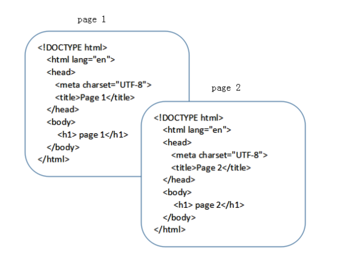
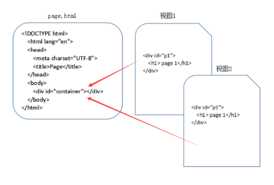

> 本文整合了两篇文章[「前端进阶」彻底弄懂前端路由](https://juejin.cn/post/6844903890278694919)
> 作者：云中桥
> 链接：https://juejin.cn/post/6844903890278694919
> 来源：稀土掘金
>
> 以及
>
> 作者：知乎用户
> 链接：https://www.zhihu.com/question/53064386/answer/258574972
> 来源：知乎

## 什么是路由

路由这个概念最先是后端出现的。在以前用模板引擎开发页面时，经常会看到这样

```text
http://hometown.xxx.edu.cn/bbs/forum.php
```

有时还会有带`.asp`或`.html`的路径，这就是所谓的SSR(Server Side Render)，通过服务端渲染，直接返回页面。


其响应过程是这样的

1.浏览器发出请求

2.服务器监听到80端口（或443）有请求过来，并解析url路径

3.根据服务器的路由配置，返回相应信息（可以是 html 字串，也可以是 json 数据，图片等）

4.浏览器根据数据包的`Content-Type`来决定如何解析数据


简单来说路由就是用来跟后端服务器进行交互的一种方式，通过不同的路径，来请求不同的资源，请求不同的页面是路由的其中一种功能。

现代前端项目多为单页Web应用(SPA)，在单页Web应用中路由是其中的重要环节。

每个现代前端框架都有与之对应的路由实现，例如 vue-router、react-router 等。


## 什么是 SPA

SPA 是 single page web application 的简称，译为单页Web应用。

简单的说 SPA 就是一个WEB项目只有一个 HTML 页面，一旦页面加载完成，SPA 不会因为用户的操作而进行页面的重新加载或跳转。 取而代之的是利用 JS 动态的变换 HTML 的内容，从而来模拟多个视图间跳转。


## 从传统页面到视图

在这里，用两张图，来分别表明传统页面与 SPA 视图间的区别：





上图表明了，在传统的网站设计中，每个HTML文件都是一个完成的HTML页面，涵盖了完整的HTML结构。





上图表明了，在 SPA 的应用设计中，一个应用只有一个HTML文件，在HTML文件中包含一个占位符（即图中的 container），占位符对应的内容由每个视图来决定，对于 SPA 来说，页面的切换就是视图之间的切换。


## 前端路由的由来

最开始的网页是多页面的，直到 Ajax 的出现，才慢慢有了 SPA。

Ajax，全称 Asynchronous JavaScript And XML，是浏览器用来实现异步加载的一种技术方案。在 90s 年代初，大多数的网页都是通过直接返回 HTML 的，用户的每次更新操作都需要重新刷新页面。及其影响交互体验，随着网络的发展，迫切需要一种方案来改善这种情况。


1996，微软首先提出 iframe 标签，iframe 带来了异步加载和请求元素的概念，随后在 1998 年，微软的 Outloook Web App 团队提出 Ajax 的基本概念（XMLHttpRequest的前身），并在 IE5 通过 ActiveX 来实现了这项技术。在微软实现这个概念后，其他浏览器比如 Mozilia，Safari，Opera 相继以 XMLHttpRequest 来实现 Ajax。（  兼容问题从此出现，话说微软命名真喜欢用X，MFC源码一大堆。。）不过在 IE7 发布时，微软选择了妥协，兼容了 XMLHttpRequest 的实现。


有了 Ajax 后，用户交互就不用每次都刷新页面，体验带来了极大的提升。


但真正让这项技术发扬光大的，(｡･∀･)ﾉﾞ还是后来的 Google Map，它的出现向人们展现了 Ajax 的真正魅力，释放了众多开发人员的想象力，让其不仅仅局限于简单的数据和页面交互，为后来异步交互体验方式的繁荣发展带来了根基。


而异步交互体验的更高级版本就是 SPA（那么问个问题，异步交互最高级的体验是什么？会在文末揭晓）—— 单页应用。单页应用不仅仅是在页面交互是无刷新的，连页面跳转都是无刷新的，为了实现单页应用，所以就有了前端路由。


SPA 的出现大大提高了 WEB 应用的交互体验。在与用户的交互过程中，不再需要重新刷新页面，获取数据也是通过 Ajax 异步获取，页面显示变的更加流畅。

但由于 SPA 中用户的交互是通过 JS 改变 HTML 内容来实现的，页面本身的 url 并没有变化，这导致了两个问题：

1. SPA 无法记住用户的操作记录，无论是刷新、前进还是后退，都无法展示用户真实的期望内容。
2. SPA 中虽然由于业务的不同会有多种页面展示形式，但只有一个 url，对 SEO 不友好，不方便搜索引擎进行收录。

前端路由就是为了解决上述问题而出现的。


## 什么是前端路由

简单的说，就是在保证只有一个 HTML 页面，且与用户交互时不刷新和跳转页面的同时，为 SPA 中的每个视图展示形式匹配一个特殊的 url。在刷新、前进、后退和SEO时均通过这个特殊的 url 来实现。

为实现这一目标，我们需要做到以下二点：

1. 改变 url 且不让浏览器像服务器发送请求。
2. 可以监听到 url 的变化

接下来要介绍的 hash 模式和 history 模式，就是实现了上面的功能


## 从 vue-router 来看前端路由实现原理

前端路由的实现其实很简单。

本质上就是检测 url 的变化，截获 url 地址，然后解析来匹配路由规则。


但是这样有人就会问：url 每次变化都会刷新页面啊？页面都刷新了，JavaScript 怎么检测和截获 url？


### hash 模式

这里的 hash 就是指 url 后的 # 号以及后面的字符。比如说 "[www.baidu.com/#hashhash](https://link.juejin.cn/?target=http%3A%2F%2Fwww.baidu.com%2F%23hashhash)" ，其中 "#hashhash" 就是我们期望的 hash 值。

在 2014 年之前，大家是通过 hash 来实现路由，url hash 就是类似于

```text
www.baidu.com/#hashhash
```

这里的 hash 就是指 url 后的 # 号以及后面的字符。其中 "#hashhash" 就是我们期望的 hash 值。

这种 `#`后面 hash 值的变化，并不会导致浏览器向服务器发出请求，浏览器不发出请求，也就不会刷新页面。另外每次 hash 值的变化，还会触发 `hashchange` 这个事件，通过这个事件我们就可以知道 hash 值发生了哪些变化。