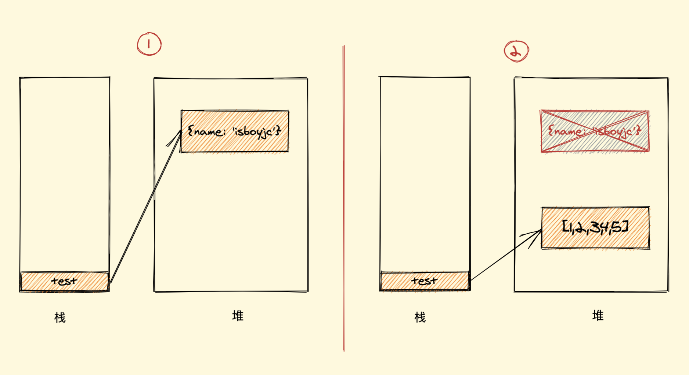

## 写在前面


我们知道垃圾回收机制是引擎来做的，JS引擎有很多种（各个浏览器都不同），其垃圾回收机制在一些细节及优化上略有不同，本文我们以一些通用的回收算法作为切入，再由 V8 引擎发展至今对该机制的优化为例（为什么以 V8 为例？因为它市场占有率大 😄 ），一步一步深入来助我们了解垃圾回收机制，因为只有真正了解垃圾回收机制，后面才能理解内存泄漏的问题以及手动预防和优化

正式开始之前，给大家列几个小问题，大家可以先想一下答案，带着问题及答案再去看文章，最后读完此文如果你的答案可以优化，即有收获：

1. 什么是垃圾回收机制？

2. 垃圾是怎样产生的？

3. 为什么要进行垃圾回收？

4. 垃圾回收是怎样进行的？

5. V8 引擎对垃圾回收进行了哪些优化？


## GC是什么


`GC` 即 `Garbage Collection` ，程序工作过程中会产生很多 `垃圾`，这些垃圾是程序不用的内存或者是之前用过了，以后不会再用的内存空间，而 `GC` 就是负责回收垃圾的，因为他工作在引擎内部，所以对于我们前端来说，`GC` 过程是相对比较无感的，这一套引擎执行而对我们又相对无感的操作也就是常说的 `垃圾回收机制` 了

当然也不是所有语言都有 `GC`，一般的高级语言里面会自带 `GC`，比如 `Java、Python、JavaScript` 等，也有无 `GC` 的语言，比如 `C、C++` 等，那这种就需要我们程序员手动管理内存了，相对比较麻烦。


## 垃圾产生&为何回收

我们知道写代码时创建一个基本类型、对象、函数……都是需要占用内存的，但是我们并不关注这些，因为这是引擎为我们分配的，我们不需要显式手动的去分配内存

但是，你有没有想过，当我们不再需要某个东西时会发生什么？JavaScript 引擎又是如何发现并清理它的呢？

我们举个简单的例子

```js
let test = {
  name: "isboyjc"
};
test = [1,2,3,4,5]
```

如上所示，我们假设它是一个完整的程序代码

我们知道 `JavaScript` 的引用数据类型是保存在堆内存中的，然后在栈内存中保存一个对堆内存中实际对象的引用，所以，`JavaScript` 中对引用数据类型的操作都是操作对象的引用而不是实际的对象。可以简单理解为，栈内存中保存了一个地址，这个地址和堆内存中的实际值是相关的

那上面代码首先我们声明了一个变量 `test`，它引用了对象 `{name: 'isboyjc'}`，接着我们把这个变量重新赋值了一个数组对象，也就变成了该变量引用了一个数组，那么之前的对象引用关系就没有了，如下图：





没有了引用关系，也就是无用的对象，这个时候假如任由它搁置，一个两个还好，多了的话内存也会受不了，所以就需要被清理（回收）。

用官方一点的话说，程序的运行需要内存，只要程序提出要求，操作系统或者运行时就必须提供内存，那么对于持续运行的服务进程，必须要及时释放内存，否则，内存占用越来越高，轻则影响系统性能，重则就会导致进程崩溃。